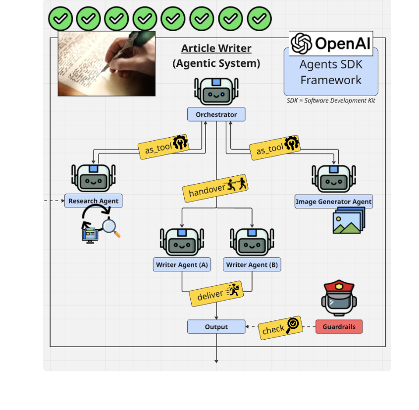

An agentic article writer system that orchestrates between research agent and image generator as tool calling before handing off to writer agents in delivering research articles.
Key concept involves - 
- Orchestration Agent - An orchestrator of a multi-agent article writing system whose job is to coordinate tools and other agents to produce a high-quality article. Orchestrator coordinates between two specialized tools to collect content and image, and handoffs to writer agents for thee final output:
    - Research Agent (for content generation)
    - Image Generator Agent (for visuals)
    - Writer Agents + Guardrails (for the final output)

- Reserach Agent - a research specialist responsible to research a given topic and produce a comprehensive research brief. Internally access two tools to produce a brief.
    - search_web: Search the web for information
    - fetch_url: Fetch and read the full content of a web page
    Typical process is 
        Search for the topic to find relevant sources
        Reflect on the search results — which sources look most relevant and why?
        Fetch the full content of the 2-3 best URLs
        Reflect on what you have gathered. Do you have enough? Are there gaps?
        If there are gaps, search again with a different query
        When you have enough information from at least 6 different sources, synthesize into a research brief

- Image Generator Agent - An image prompt specialist to generate a hero image using a detailed DALL-E prompt from a topic and content summary. 
craft a detailed DALL-E prompt for a hero imag

